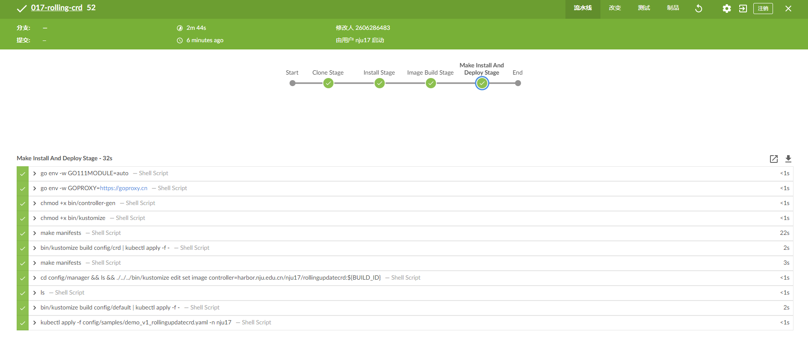

2022年南京大学软件学院暑期课程——云原生大作业

## 0 项目与组员介绍

### 0.1 项目地址与结构

项目地址（GitHub）：https://github.com/nutlets/CloudNative.git

项目结构如下图所示：


### 0.2 成员介绍

本小组为第17组，成员为以下2人：

| 姓名   | 学号         | 联系方式（QQ）   |
| ------ |------------|------------|
| 罗瑞航 | 201250117  | 2606286483 |
| 尹麒深 | 201250139  | 876865565  |


## 1 功能要求

### 1.1 实现接口展示

使用网页工具生成SpringBoot框架后，添加如下接口。通过http://localhost:8080/getMsg就可以访问该接口。REST风格接口展示：


### 1.2 限流功能展示

使用令牌桶算法来限流，使用WebStorm中的请求生成工具来测试，该工具如图所示。


#### 1、访问成功——HTTP头中状态为200

访问成功图片如下图所展示。


#### 2、触发限流——HTTP头中状态为429


#### 3、实现代码之令牌桶算法限流

```java
package com.example.demo.Strategy;
import com.google.common.util.concurrent.RateLimiter;
import java.lang.reflect.Method;
import java.util.concurrent.ConcurrentHashMap;
import org.aspectj.lang.ProceedingJoinPoint;
import org.aspectj.lang.Signature;
import org.aspectj.lang.annotation.Around;
import org.aspectj.lang.annotation.Pointcut;
import org.aspectj.lang.reflect.MethodSignature;
import org.springframework.stereotype.Component;

@org.aspectj.lang.annotation.Aspect
@Component
public class StrategyAspect {
    private final ConcurrentHashMap<String, RateLimiter> RATE_LIMITER  = new ConcurrentHashMap<>();

    @Pointcut("@annotation(com.example.demo.Strategy.Strategy)")
    public void serviceLimit() {}

    @Around("serviceLimit()")
    public Object around(ProceedingJoinPoint point) throws Throwable {

        MethodSignature method_sig = (MethodSignature) point.getSignature();
        Object target = point.getTarget();
        Method currentMethod = target.getClass().getMethod(method_sig.getName(), method_sig.getParameterTypes());
        Strategy annotation = currentMethod.getAnnotation(Strategy.class);
        double limitNum = annotation.token_num();
        String functionName = method_sig.getName(); // 限流策略

        if (!RATE_LIMITER.containsKey(functionName))
            RATE_LIMITER.put(functionName, RateLimiter.create(limitNum));
        RateLimiter rateLimiter = RATE_LIMITER.get(functionName);

        if(rateLimiter.tryAcquire())  return point.proceed();
        else throw new StrategyException(); //返回异常，此处为429
    }
}
```

#### 4、返回429的实现

在全局异常捕捉的类中定义，可以自定义特定的异常来返回特定的状态码。

查阅资料知，在SpringBoot中关于状态码有一个枚举类型如下。

```java
public enum HttpStatus {
    CONTINUE(100, "Continue"),
    SWITCHING_PROTOCOLS(101, "Switching Protocols"),
    PROCESSING(102, "Processing"),
    CHECKPOINT(103, "Checkpoint"),
    OK(200, "OK"),
    ...
    TOO_MANY_REQUESTS(429, "Too Mant Requests"),
    ...
}        
```

所以我们在策略目录下，StrategyException文件中中添加以下代码。

```java
package com.example.demo.Strategy;
import org.springframework.http.HttpStatus;
import org.springframework.web.bind.annotation.ResponseStatus;

@ResponseStatus(value = HttpStatus.TOO_MANY_REQUESTS)
public class StrategyException extends Exception{}
```

## 2 DevOps要求

### 2.1 DockerFile与镜像

在目录中添加DockerFile。


```dockerfile
# 基于java镜像创建新镜像

FROM java:8

# 作者

MAINTAINER Giesen

# 将jar包添加到容器中并更名为app.jar

ADD  target/demo-0.0.1-SNAPSHOT.jar ./app.jar

# 运行jar包

ENTRYPOINT ["nohup","java","-jar","./app.jar","&"]

EXPOSE 8080

# docker build -t demo .
# docker run -d -p 8080:8080 --name my_demo_03 sbdemo:latest

```

运行效果：建立镜像。

### 2.2 K8s编排文件

此处将所有相关的yaml编排文件放在cloud-native.yaml文件之中（不包括普罗米修斯相关注册）。

```yaml
#编排文件1：Deployment
apiVersion: apps/v1
kind: Deployment
metadata:
    name: cloud-native
    namespace: nju17
spec:
    replicas: 3
    strategy:
        type: RollingUpdate
        rollingUpdate:
            maxSurge: 30%
            maxUnavailable: 30%
    selector:
        matchLabels:
            app: cloud-native
    template:
        metadata:
            labels:
                app: cloud-native
        spec:
            containers:
                - image: harbor.edu.cn/nju17/cloud-native-demo
                  name: cloud-native
                  ports:
                      -   containerPort: 8080
                  resources:
                      requests:
                          cpu: 400m

---

#编排文件2：Service
apiVersion: v1
kind: Service
metadata:
    name: cloud-native-service
    namespace: nju17
    labels:
        app: cloud-native-service
        micrometer-prometheus-discovery: 'true'
spec:
    type: NodePort
    ports:
        - port: 8080
          targetPort: 8080
          nodePort: 30876
          name: cloud-native-service-port
          protocol: TCP
    selector:
        app: cloud-native
```

### 2.3 单元测试与测试通过的场景

我们撰写了如下的单元测试，使用Bean注入技术。代码如下图所示：


测试通过的场景：


再使用Jmeter进行流量测试，发现都能通过。


由于每秒100次压力过大，我们将代码设置为每秒10次访问上限后，再使用Jmeter进行测试，出现了大量的429错误。


### 2.4 Jenkins持续部署与持续集成

使用如下的代码作为Jenkinsfile。

```yaml
pipeline {
    agent none
    stages {
        stage('Clone Code') {
            agent {
                label 'master'
            }
            steps {
                echo "1.Git Clone Code"
                git url: "https://gitee.com/Giesen_Ian/cloud_-native.git"
                //git url: "https://github.com/nutlets/CloudNative.git"
            }
        }
        stage('Maven Build') {
            agent {
            docker {
                image 'maven:latest'
                args '-v /root/.m2:/root/.m2'
            }
            }
            steps {
                echo "2.Maven Build Stage"
                sh 'mvn -B clean package -Dmaven.test.skip=true'
            }
        }
        stage('Image Build') {
            agent {
                label 'master'
            }
            steps {
                echo "3.Image Build Stage!!!"
                sh 'docker build -f Dockerfile --build-arg jar_name=target/demo-0.0.1-SNAPSHOT.jar -t cloud-native-demo:${BUILD_ID} . '
                echo 'Building Success!'
                sh 'docker tag cloud-native-demo:${BUILD_ID} harbor.edu.cn/nju17/cloud-native-demo:${BUILD_ID}'
                echo 'Push Success!'
            }
        }
        stage('Push') {
            agent {
                label 'master'
            }
            steps {
                echo "4.Push Docker Image Stage"
                sh "docker login --username=nju17 harbor.edu.cn -p nju172022"
                sh "docker push harbor.edu.cn/nju17/cloud-native-demo:${BUILD_ID}"
            }
        }
    }

}
node('slave') {
    container('jnlp-kubectl') {
        stage('Clone YAML') {
            echo "5. Git Clone YAML To Slave"
            git url: "https://gitee.com/Giesen_Ian/cloud_-native.git"
            //git url: "https://github.com/nutlets/CloudNative.git"
        }
        stage('YAML') {
            echo "6. Change YAML File Stage"
            sh 'sed -i "s#{VERSION}#${BUILD_ID}#g" cloud-native.yaml'
        }
        stage('Deploy') {
            echo "7. Deploy To K8s Stage"
            sh 'kubectl apply -f cloud-native.yaml'
        }
    }
}
```

现在使用学校提供的Jenkins平台并进行部署。项目配置如图所示：


部署成功的结果：


该部分中已经包含了持续部署流水线和持续集成流水线，并可以将项目部署到K8s集群。可以看到Pods如下：


## 3 扩容场景

### 3.1 Prometheus的注册与使用

首先在项目依赖文件pom.xml中添加如下的两个依赖：

```xml
<!--actuator-->
<dependency>
	<groupId>org.springframework.boot</groupId>
	<artifactId>spring-boot-starter-actuator</artifactId>
	<version>2.7.0</version>
</dependency>
<!--prometheus 监控-->
<dependency>
	<groupId>io.micrometer</groupId>
	<artifactId>micrometer-registry-prometheus</artifactId>
	<version>1.9.0</version>
</dependency>
```

再将Bean添加到项目文件中：


还需要使用以下的yaml编排文件注册普罗米修斯服务，这部分内容统一位于cloud-native.yaml中。

```yaml
#编排文件3：Monitor，实现普罗米修斯功能注册
apiVersion: monitoring.coreos.com/v1
kind: ServiceMonitor
metadata:
    name: cloud-native-monitor
    namespace: nju17
spec:
    endpoints:
        - interval: 15s
          path: /actuator/prometheus
          port: cloud-native-service-port
    namespaceSelector:
        any: true
    selector:
        matchLabels:
            micrometer-prometheus-discovery: 'true'
```

### 3.2 接入校园Prometheus以及Grafana监控大屏

现在pod的情况如图所示。


使用学校提供的软件研发效能支撑平台进入普罗米修斯相关项，点击targets，可以看到目前的部署状况，和在ssh中看到的pod情况一致。


使用Grafana监控大屏。


### 3.3 使用Jmeter压力测试并观察监控数据

现在使用Jmeter进行压力测试，在Jmeter中可以看到很多测试都报错429。


前几次测试失败，总是404错误...经排查以后发现是没有将节点进行版本管控导致使用了原先的节点。排除这个问题后可以看到Grafana中接收到的包数量大幅上升，cpu占用率大幅上升。

手动扩容代码如下所示：

```linux
[nju17@host-172-29-4-18 ~]$ kubectl scale deployment cloud-native --replicas=3 -n nju17
```

现在发现，节点数从1个变成了3个。


现在使用Jmeter测试，可以通过，观察容器的包接受率，可以发现接受率上升。


### 3.4 Rolling Update CRD和Controller实现

####3.4.1 CRD项目地址：https://github.com/nutlets/RollingCrd
####3.4.2 目录结构如下：

####3.4.3 关键代码如下：
比较关键的yaml文件：

在demo.roll.io_rollingupdatecrds.yaml中：
```yaml
---
apiVersion: apiextensions.k8s.io/v1
kind: CustomResourceDefinition
metadata:
  annotations:
    controller-gen.kubebuilder.io/version: v0.9.0
  creationTimestamp: null
  name: rollingupdatecrds.demo.roll.io
spec:
  group: demo.roll.io
  names:
    kind: RollingUpdateCrd
    listKind: RollingUpdateCrdList
    plural: rollingupdatecrds
    singular: rollingupdatecrd
  scope: Namespaced
  versions:
  - name: v1
    schema:
      openAPIV3Schema:
        description: RollingUpdateCrd is the Schema for the rollingupdatecrds API
        properties:
          apiVersion:
            description: 'APIVersion defines the versioned schema of this representation
              of an object. Servers should convert recognized schemas to the latest
              internal value, and may reject unrecognized values. More info: https://git.k8s.io/community/contributors/devel/sig-architecture/api-conventions.md#resources'
            type: string
          kind:
            description: 'Kind is a string value representing the REST resource this
              object represents. Servers may infer this from the endpoint the client
              submits requests to. Cannot be updated. In CamelCase. More info: https://git.k8s.io/community/contributors/devel/sig-architecture/api-conventions.md#types-kinds'
            type: string
          metadata:
            type: object
          spec:
            description: RollingUpdateCrdSpec defines the desired state of RollingUpdateCrd
            properties:
              deploymentName:
                description: Foo is an example field of RollingUpdateCrd. Edit rollingupdatecrd_types.go
                  to remove/update
                type: string
            type: object
          status:
            description: RollingUpdateCrdStatus defines the observed state of RollingUpdateCrd
            type: object
        type: object
    served: true
    storage: true
    subresources:
      status: {}

```
在demo_v1_rollingupdatecrd.yaml中：
```yaml
apiVersion: demo.roll.io/v1
kind: RollingUpdateCrd
metadata:
  name: rolling-update-crd
  namespace: nju17
spec:
  deploymentName: cloud-native
  # TODO(user): Add fields here

```

比较关键的实现代码块：

在rollingupdatecrd_types.go中：
```go
type RollingUpdateCrdSpec struct {
	DeploymentName string `json:"deploymentName,omitempty"`
}
type RollingUpdateCrdStatus struct {
}

```
在rollingupdatecrd_controller.go中：
```go
func (r *RollingUpdateCrdReconciler) Reconcile(ctx context.Context, req ctrl.Request) (ctrl.Result, error) {
	logger := log.FromContext(ctx)

	// TODO(user): your logic here
	logger.Info("start reconcile")
	rollingUpdateCrd := &demov1.RollingUpdateCrd{}

	key := client.ObjectKey{Namespace: req.Namespace, Name: req.Name}
	if err := r.Get(ctx, key, rollingUpdateCrd); err != nil {
		logger.Error(err, "get target obj failed")
		return ctrl.Result{}, err
	}

	if rollingUpdateCrd.ObjectMeta.DeletionTimestamp.IsZero() {
		if !controllerutil.ContainsFinalizer(rollingUpdateCrd, MonitorFinalizer) {
			controllerutil.AddFinalizer(rollingUpdateCrd, MonitorFinalizer)
			if err := r.Update(ctx, rollingUpdateCrd); err != nil {
				logger.Error(err, "add MonitorFinalizer failed")
				return ctrl.Result{}, err
			}
		}
	} else {
		if controllerutil.ContainsFinalizer(rollingUpdateCrd, MonitorFinalizer) {
			monitor.RemoveMonitoredDeploy(rollingUpdateCrd.Namespace, rollingUpdateCrd.Spec.DeploymentName)
			controllerutil.RemoveFinalizer(rollingUpdateCrd, MonitorFinalizer)
			if err := r.Update(ctx, rollingUpdateCrd); err != nil {
				logger.Error(err, "remove MonitorFinalizer failed")
				return ctrl.Result{}, err
			}
		}
		return ctrl.Result{}, nil
	}

	monitor.AddMonitorDeploy(rollingUpdateCrd.Namespace, rollingUpdateCrd.Spec.DeploymentName)

	return ctrl.Result{}, nil
}
```
在event_handler中：
```go
type RSEventHandler struct{}

func (h RSEventHandler) OnAdd(obj interface{}) {
	rs := obj.(*appsv1.ReplicaSet)
	for _, v := range rs.OwnerReferences {
		if v.Kind != "Deployment" {
			klog.Warningf("unexpected type %s", v.Kind)
			continue
		}
		if CheckMonitored(rs.Namespace, v.Name) {
			klog.Info("Add: ")
			printReplicaInfo(rs)
			return
		}
	}
}

func (h RSEventHandler) OnUpdate(oldObj, newObj interface{}) {
	rs1 := oldObj.(*appsv1.ReplicaSet)
	rs := newObj.(*appsv1.ReplicaSet)
	for _, v := range rs.OwnerReferences {
		if v.Kind != "Deployment" {
			klog.Warningf("unexpected type %s", v.Kind)
			continue
		}
		if CheckMonitored(rs.Namespace, v.Name) {
			klog.Info("Update: ")
			printReplicaInfo1(rs, rs1)
			return
		}
	}
}
func printReplicaInfo1(rs *appsv1.ReplicaSet, rs1 *appsv1.ReplicaSet) {

	klog.Infof("oldInfo %s/%s rs info: expected replica %d, current replica %d, ready replica %d %n", rs1.Namespace, rs1.Name, *rs1.Spec.Replicas, rs1.Status.Replicas, rs1.Status.ReadyReplicas)

	klog.Infof("newInfo %s/%s rs info: expected replica %d, current replica %d, ready replica %d", rs.Namespace, rs.Name, *rs.Spec.Replicas, rs.Status.Replicas, rs.Status.ReadyReplicas)
}
func printReplicaInfo(rs *appsv1.ReplicaSet) {

	klog.Infof("%s/%s rs info: expected replica %d, current replica %d, ready replica %d", rs.Namespace, rs.Name, *rs.Spec.Replicas, rs.Status.Replicas, rs.Status.ReadyReplicas)
}

func (h RSEventHandler) OnDelete(obj interface{}) {
	rs := obj.(*appsv1.ReplicaSet)
	for _, v := range rs.OwnerReferences {
		if v.Kind != "Deployment" {
			klog.Warningf("unexpected type %s", v.Kind)
			continue
		}
		if CheckMonitored(rs.Namespace, v.Name) {
			klog.Info("Delete: ")
			printReplicaInfo(rs)
			return
		}
	}
}
```
功能的说明：

**这里我们实现了当被监控的deployment资源添加、更新、删除时，打印它的Namespace\Name\Spec.Replicas\Status.Replicas\Status.ReadyReplicas，从而实现对此滚动升级的监控。**


####3.4.4 CRD项目的Jenkins部署
此项目的jenkinsfile：
```yaml
node('slave') {
    container('jnlp-kubectl') {

            stage('Clone Stage') {
                sh 'curl "http://p.nju.edu.cn/portal_io/login" --data "username=201250117&password=hanghang5214.." '
                git branch: 'master', url: "https://github.com/nutlets/RollingCrd.git"
            }
            stage('Install Stage') {
                echo 'Install make'
                sh '''
                yum -y install make
                make -v
               '''
               echo 'install golang'
                sh '''
                yum install -y epel-release
                yum -y install golang
                go version
                echo $GOPATH
                '''
            }

            stage('Image Build Stage') {
                sh 'docker build -f Dockerfile -t rollingupdatecrd:${BUILD_ID} .'
                sh 'docker tag rollingupdatecrd:${BUILD_ID} harbor.edu.cn/nju17/rollingupdatecrd:${BUILD_ID}'
                sh 'docker login harbor.edu.cn -u nju17 -p nju172022'
                sh 'docker push harbor.edu.cn/nju17/rollingupdatecrd:${BUILD_ID}'
            }

            stage('Make Install And Deploy Stage'){


                sh 'go env -w GO111MODULE=auto'
                sh 'go env -w GOPROXY=https://goproxy.cn'
                sh 'chmod +x bin/controller-gen'
                sh 'chmod +x bin/kustomize'
                // sh 'make install'
                sh 'make manifests'
                sh 'bin/kustomize build config/crd | kubectl apply -f -'

                sh 'make manifests'
                sh 'cd config/manager && ls && ./../../bin/kustomize edit set image controller=harbor.nju.edu.cn/nju17/rollingupdatecrd:${BUILD_ID}'
                sh 'ls'
                sh 'bin/kustomize build config/default | kubectl apply -f -'

                sh 'kubectl apply -f config/samples/demo_v1_rollingupdatecrd.yaml -n nju17'
            }


    }
}
```
jenkins上部署成功的截图：

####3.4.5k8s集群上的表现：
1.我们所创建的CRD名称为RollingUpdateCrd，我们获取一下它。

可以看到我们确实成功创建了它。


### 3.5 自动扩容

在之前未扩容、容量为1的100线程压力测试中，服务器会返回大量的429。

现在实现手动扩容，在命令行工具中输入以下代码。

```
[nju17@host-172-29-4-18 ~]$ kubectl autoscale deployment cloud-native --cpu-perscent=75 --min=1 --max=12 -n nju17
```

其中，选择autoscale，cpu占用率到达百分之75以后便会自动扩容。

为了不占用更多的空间，我们设置容量的最小值为1，最大值为12。


可以看到，自动扩容后可以通过100线程的压力测试。